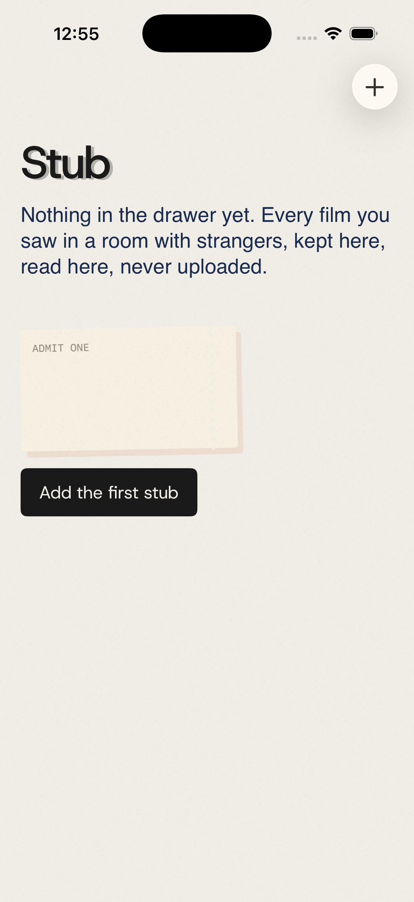
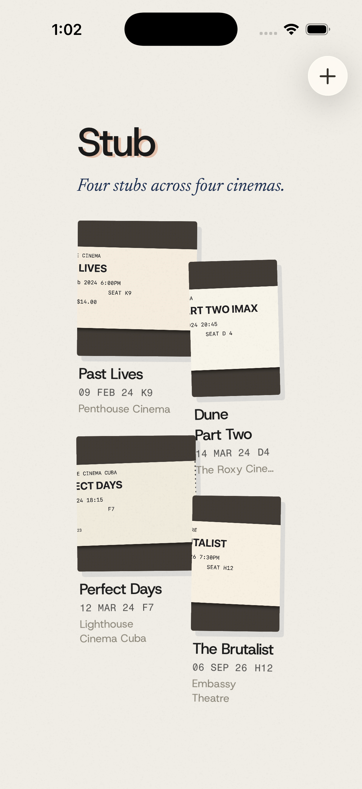

# Stub

**A private archive of every film you saw in a room with strangers.** Photograph the ticket stub. The phone reads it, understands it, files it. Nothing leaves the device.

Native Swift, iOS 26. Built in the open over seven scheduled days, 6–13 September 2026, one slot a day. Playbook in [`PLAYBOOK.md`](PLAYBOOK.md), decisions in [`DECISIONS.md`](DECISIONS.md), the look in [`DESIGN.md`](DESIGN.md), what actually happened each day in [`docs/LOG.md`](docs/LOG.md).

<p>


</p>

## What it uses, and why each one is worth a post

| Layer | Apple technology | In Stub |
|---|---|---|
| Read | Vision `RecognizeDocumentsRequest` (iOS 26), `RecognizeTextRequest` fallback | Lifts the printed lines off the stub in reading order |
| Understand | **Foundation Models** — `@Generable` guided generation, `SystemLanguageModel.availability` | Title, cinema, date, screen, seat, price from the raw lines. A heuristic parser is the floor and the fallback ([ADR-001](DECISIONS.md#adr-001--the-heuristic-parser-is-the-floor-the-model-is-measured-against-it)) |
| Look | Metal `[[stitchable]]` shaders via SwiftUI `colorEffect` / `layerEffect` | Silkscreen onto parchment, a misregistered orange plate, paper grain ([ADR-002](DECISIONS.md#adr-002--the-look-is-specified-in-swiftui-first-metal-is-an-implementation-not-the-identity)) |
| Keep | SwiftData with `.externalStorage` | Local, no account, no network ([ADR-005](DECISIONS.md#adr-005--private-by-construction)) |
| Feel | Spring animation, `sensoryFeedback`, Reduce Motion | Stubs lie tilted until touched, then sit up straight |
| Reach (Day 5) | App Intents, WidgetKit | "Log a stub" from Shortcuts; last stub on the lock screen |
| Camera (Day 6) | VisionKit `DataScannerViewController` | Live text on a physical stub, device only |

## Run it

Requires Xcode 26 with an iOS 26 simulator and [XcodeGen](https://github.com/yonaskolb/XcodeGen) (`brew install xcodegen`).

```bash
git clone https://github.com/brunohart/stub && cd stub
scripts/build.sh                       # xcodegen + simulator build
scripts/test.sh                        # unit tests on a booted iPhone 17 Pro
scripts/run.sh --seed --reset --shot docs/screenshots/now.png
```

`--seed` pushes the four synthetic stubs in `fixtures/` through the real Vision → parser pipeline on launch, so the simulator has a full drawer without a camera or a hand on the screen. The log printed afterwards says which parser read each stub and why.

## Honesty

On Day 0 the on-device model said it was available and then refused every request in the simulator (`ModelManagerError 1026`). The heuristic parser filed all four fixtures correctly. That is why the heuristic exists and why every stub records who read it. The eval table comparing the two lands on Day 3.

## Licence

MIT for the code. Fonts are Host Grotesk, Newsreader and Fragment Mono under the SIL Open Font License, included in `Stub/Resources/Fonts`.
