# Stub

**A private archive of every film you saw in a room with strangers.** Photograph the ticket stub. The phone reads it, understands it, files it. Nothing leaves the device.

Native Swift, iOS 26. Built in the open over seven scheduled days, 6–13 September 2026, one slot a day, each slot proving its work with a screenshot from the simulator. Playbook in [`PLAYBOOK.md`](PLAYBOOK.md), decisions in [`DECISIONS.md`](DECISIONS.md), the look in [`DESIGN.md`](DESIGN.md), what actually happened each day in [`docs/LOG.md`](docs/LOG.md), what the two readers score in [`docs/evals.md`](docs/evals.md), what only a phone can prove in [`docs/device.md`](docs/device.md). The write-up is [`docs/post.md`](docs/post.md). Tagged `v0.1.0` on Day 7.

<p>
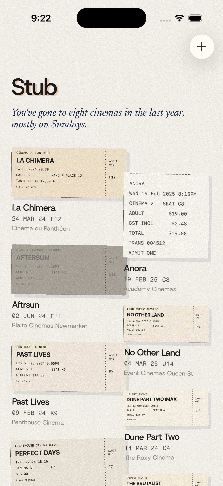
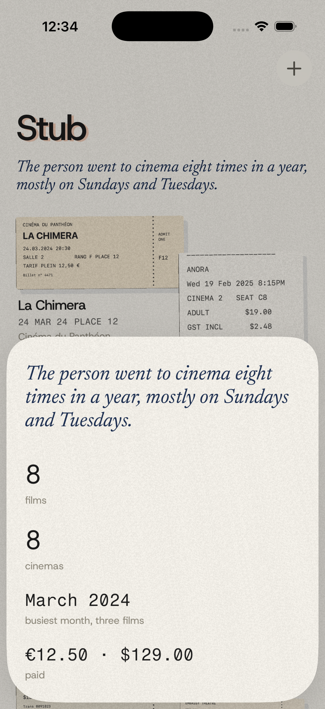
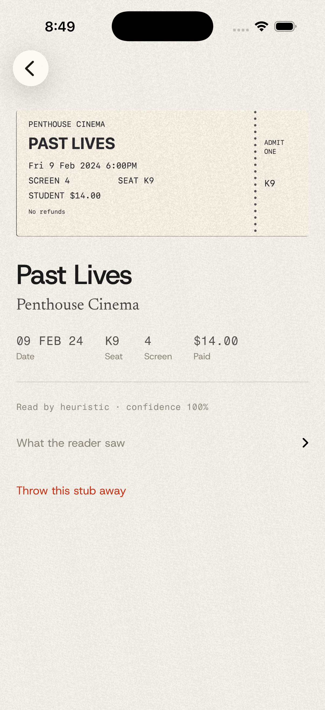
</p>

## What it uses, and why each one is worth a post

| Layer | Apple technology | In Stub |
|---|---|---|
| Read | Vision `RecognizeDocumentsRequest` (iOS 26), `RecognizeTextRequest` fallback | Lifts the printed lines off the stub in reading order |
| Crop | Vision `DetectDocumentSegmentationRequest`, `DetectRectanglesRequest`, Core Image perspective correction | The card is the ticket, not the table it was lying on. Two detectors, because one lies on the simulator ([ADR-007](DECISIONS.md#adr-007--two-detectors-for-the-crop-and-a-quadrilateral-that-hugs-the-frame-is-not-a-ticket)) |
| Understand | **Foundation Models**: `@Generable` guided generation, streamed snapshots, `SystemLanguageModel.availability` | Title, cinema, date, screen, seat, price from the raw lines, with the heuristic's draft as a hint. A regex parser is the floor and the fallback ([ADR-001](DECISIONS.md#adr-001--the-heuristic-parser-is-the-floor-the-model-is-measured-against-it), [ADR-010](DECISIONS.md#adr-010--the-model-reads-with-the-heuristics-draft-in-hand-and-is-scored-in-the-drawers-shapes)) |
| Say | Foundation Models again | One dry sentence about the drawer, counted by hand and only phrased by the model, judged on the way out ([ADR-011](DECISIONS.md#adr-011--the-season-is-counted-by-hand-and-only-phrased-by-the-model)) |
| Look | Metal `[[stitchable]]` shaders via SwiftUI `colorEffect` / `layerEffect` | Silkscreen onto parchment, a misregistered orange plate, paper grain ([ADR-002](DECISIONS.md#adr-002--the-look-is-specified-in-swiftui-first-metal-is-an-implementation-not-the-identity)) |
| Keep | SwiftData with `.externalStorage`, in an App Group | Local, no account, no network ([ADR-005](DECISIONS.md#adr-005--private-by-construction), [ADR-012](DECISIONS.md#adr-012--one-drawer-in-an-app-group-the-app-writes-it-the-widget-reads-it-an-intent-runs-inside-the-app)) |
| Feel | `navigationTransition(.zoom)`, one spring family, `sensoryFeedback`, Reduce Motion | Stubs lie tilted until touched, then sit up straight; hold one and the print lifts |
| Reach | App Intents, WidgetKit | "Log a stub in Stub", "How many films this year in Stub"; the last stub on the home and lock screen |
| Camera | VisionKit `DataScannerViewController` | Live text on a physical stub, feeding the same parsers. Device only |
| Access | VoiceOver, Dynamic Type, 44pt targets | Every card says what it knows; one column at the accessibility sizes ([ADR-013](DECISIONS.md#adr-013--the-table-is-two-columns-until-the-type-gets-large-at-the-accessibility-sizes-it-is-one)) |

## Seven days

| Day | Shipped | Proof |
|---|---|---|
| 0 | The whole skeleton: model, reader, two parsers, look, table, import, seed path, fixtures, scripts, playbook, ADRs |   |
| 1 | The look goes to Metal behind a switch; the reader crops the ticket out of the photograph; the model probe at launch | 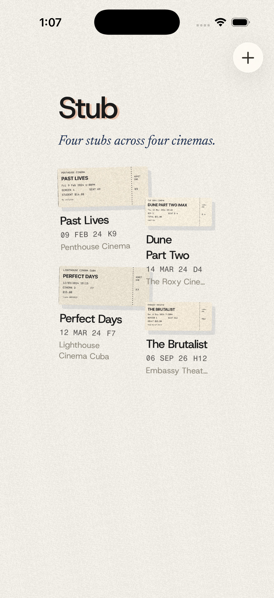 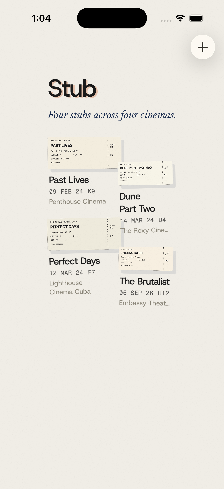 |
| 2 | Zoom transition, press physics tuned to overshoot once, hold-to-lift the silkscreen, a haptic when the plate lands; the empty drawer breathes once | 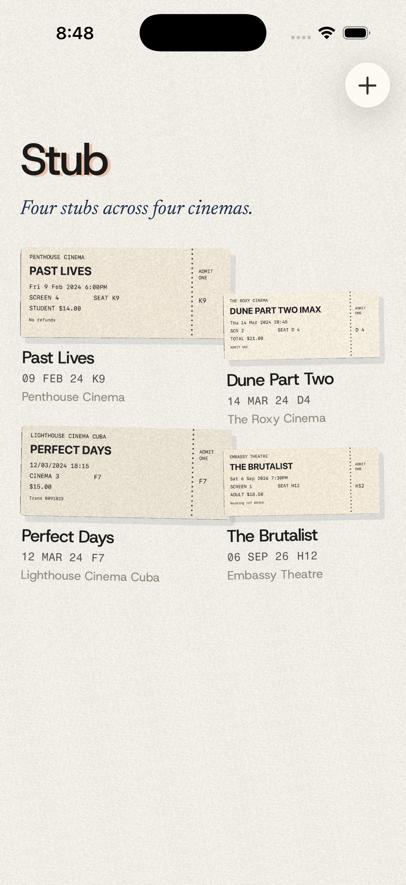 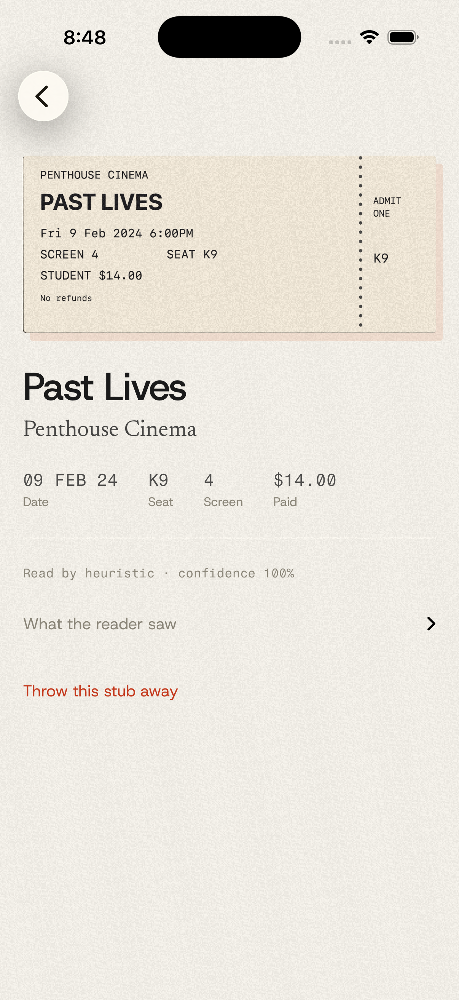  |
| 3 | The model streams into the fields, reads with the heuristic's draft as a hint, and is scored in the drawer's shapes; the eval harness and four harder fixtures |  |
| 4 | The season line, counted by hand, phrased by the model, judged on the way out, cached per drawer; the season sheet |  |
| 5 | App Intents and Shortcuts phrases; the widget; the drawer moves into an App Group | 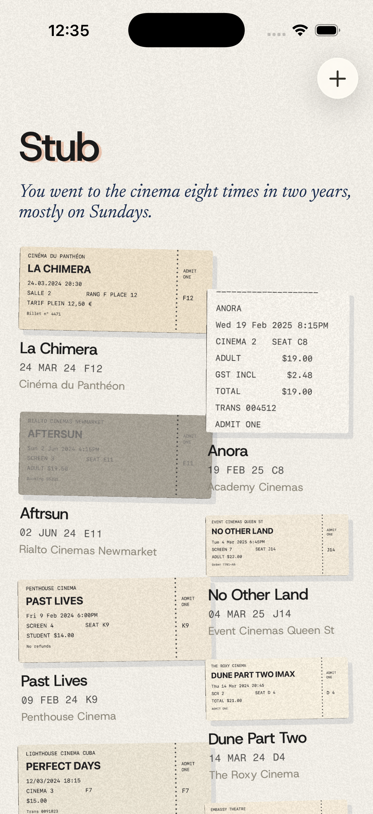 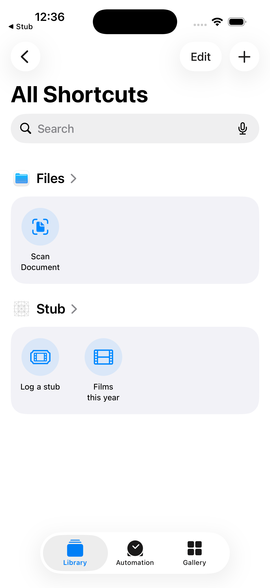 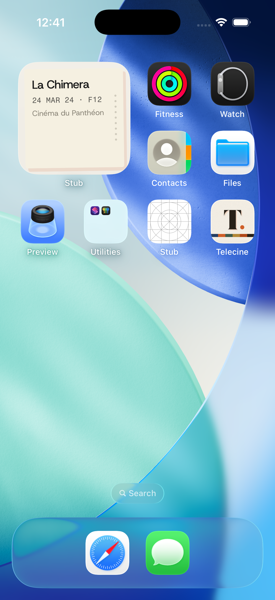 |
| 6 | The camera path through VisionKit, gated to devices; the icon, drawn by script; the accessibility pass | 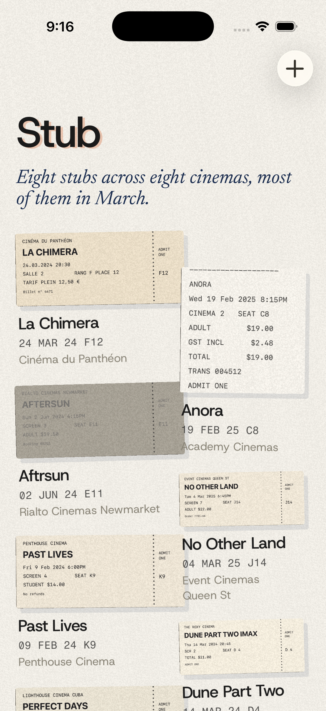 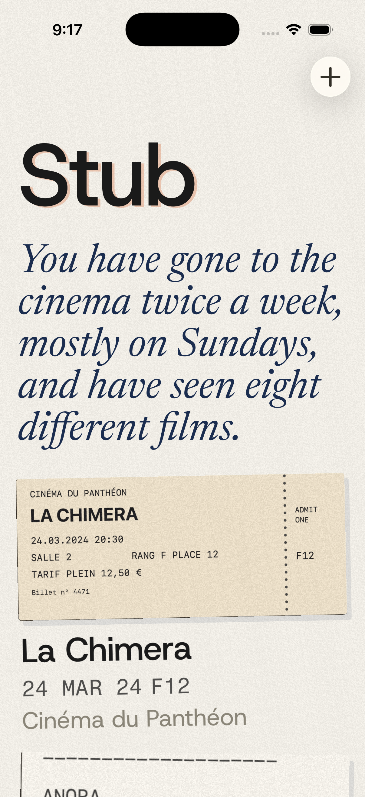 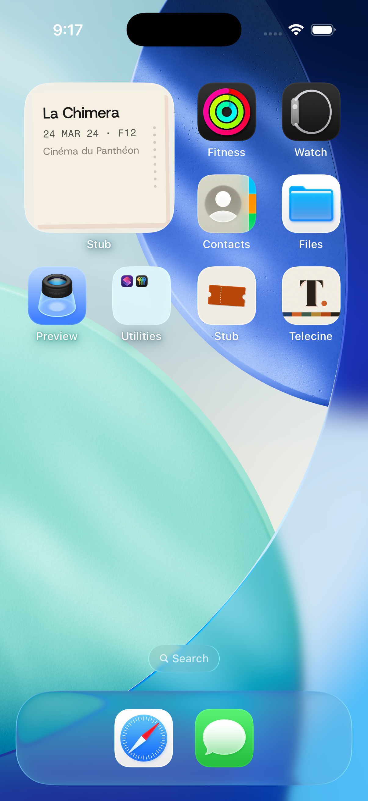 |
| 7 | This README, the post, the device notes, `v0.1.0` |  |

## Run it

Requires Xcode 26 with an iOS 26 simulator and [XcodeGen](https://github.com/yonaskolb/XcodeGen) (`brew install xcodegen`). For the on-device model, Apple Intelligence on the Mac and (on this host) the iOS 26.5 simulator runtime.

```bash
git clone https://github.com/brunohart/stub && cd stub
scripts/build.sh                       # xcodegen + simulator build
scripts/test.sh                        # 48 tests on a booted iPhone 17 Pro; the eval suite takes ~3 minutes with the model present
scripts/run.sh --seed --reset --wait-for "written|hand-counted" --shot docs/screenshots/now.png
```

`--seed` pushes the eight synthetic stubs in `fixtures/` through the real crop → Vision → parser pipeline on launch, so the simulator has a full drawer without a camera or a hand on the screen. The log printed afterwards says which detector cropped each stub, which parser read it, and how long the model took. `--drive` presses, opens and holds on a timer so the interactions can be filmed; `--season` and `--import` open those sheets; `--type accessibility-extra-large` sets Dynamic Type for the run; `--look swiftui` draws the Day 0 look instead of the shaders.

To run it on a phone: [`docs/device.md`](docs/device.md).

## What the two readers score

`docs/evals.md` is written by a test that runs every fixture through the real pipeline and scores the heuristic parser, the cold model and the hinted model against `fixtures/expected.json`. The Day 6 table:

| Field | heuristic | model, cold | model + hint |
|---|---|---|---|
| title | 8/8 | 8/8 | 7/8 |
| cinema | 8/8 | 6/8 | 8/8 |
| date | 8/8 | 5/8 | 8/8 |
| screen | 8/8 | 8/8 | 8/8 |
| seat | 8/8 | 7/8 | 8/8 |
| price | 8/8 | 2/8 | 8/8 |

Heuristic in about a millisecond; the model in 8.6 s median on the simulator's CPU fallback, hinted or cold. The one hinted miss is "Aftrsun" off the pale fixture, with the right spelling in the hint. The table is a sample of a reader that is not the same twice; the log records the runs where it scored differently.

## Honesty

On Day 0 the on-device model said it was available and then refused every request in the simulator (`ModelManagerError 1026`). The heuristic parser filed all four fixtures correctly. That is why the heuristic exists and why every stub records who read it and how sure it was. On Day 1 Vision's document segmentation did the same thing, returning a confident strip of table for every ticket, and the arithmetic rectangle detector became the second floor. The model first answered on Day 3, once the host's assets were there (and, as checking the simulator runtimes showed, only on a runtime that matches the host: iOS 26.5 against macOS 26.6, not 26.2). Cold, it reads two of eight prices; with the heuristic's draft as a hint it matches the heuristic on every field but one. The model reads with the hint; the heuristic stays the floor.

What is not proved: the camera path, the Siri phrases and the lock-screen widget need a signed build on a phone. The eval table is eight synthetic tickets. Each day's log ends with a "Still rough" paragraph that says what was left that way.

## Licence

MIT for the code. Fonts are Host Grotesk, Newsreader and Fragment Mono under the SIL Open Font License, included in `Stub/Resources/Fonts`.
