# Stub

**A private archive of every film you saw in a room with strangers.**

Photograph the ticket stub. The phone reads it, files it, and gives you two things back: the stub as it was scanned, and an **edition**, a ticket designed for that film's release, printed with your own seat and night, lit by the phone and felt under your finger. Then you can take the edition to the **press** and pull your own proof of it, put it on a real table, and send it turning in the light. Nothing leaves the device.

Native Swift and SwiftUI, Metal, Vision, Foundation Models, Core Haptics, RealityKit. iOS 26, built and proved daily in the iOS 27 simulator.

<p>
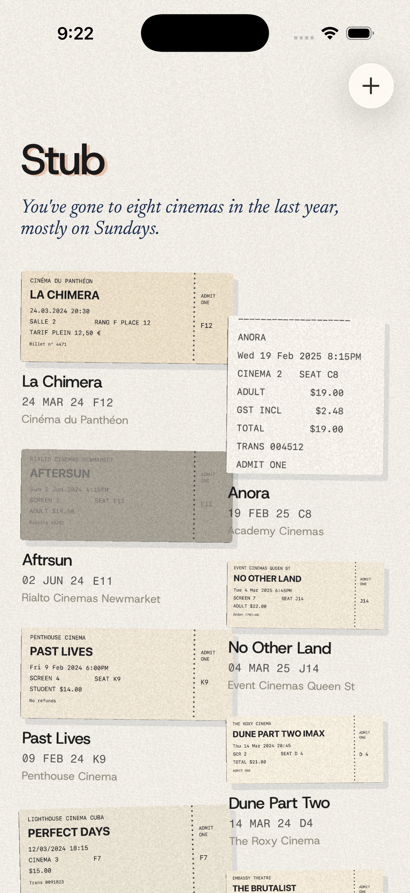
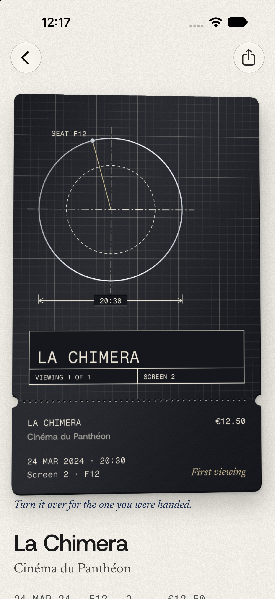

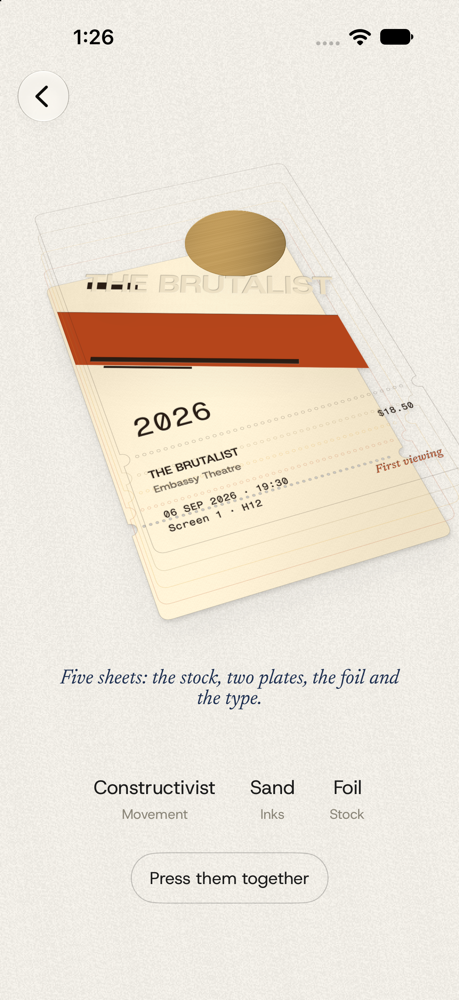
</p>

<sub>The drawer · an edition · the press, halfway between two takes · the card taken apart into its plates</sub>

---

## Three objects

### The drawer

Stubs are tipped onto a table rather than filed in a grid: two uneven columns, 1.15 to 0.85, overlapping by six points. Every stub keeps the tilt it was given when it was filed, between −1.5° and 1.5° and never level, and sits up straight when touched. The photograph is silkscreened onto parchment, with the orange plate a few points out of register. Hold a stub and the print washes off to show the photograph underneath.

Vision reads the stub on the device. A rule-based parser reads it first, always. The on-device model then reads it with that draft in hand, and is scored against it. Every stub says who read it and how sure it was.

### The edition

Every release gets one design, and every stub of that release prints its own copy: the seat, the date, the cinema, and whether it was the first viewing or the third. The design comes from a closed vocabulary: eight movements, twelve palettes and four stocks. The on-device model chooses between those words; it never chooses a colour, a position or a letter. The release's hash draws everything under them, so there is always an edition, on any phone, before the model answers or if it never does.

<p>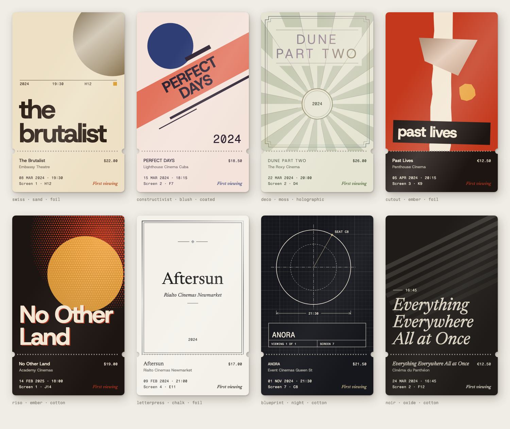</p>

<sub>All eight movements, drawn in a browser by <a href="docs/editions/edition.js"><code>edition.js</code></a>, which rolls the same dice in the same order as the Swift. It is a design tool and a specimen; the proof is the simulator.</sub>

The card is lit by one light, and it is the phone's. Tilt the phone and the light moves across the ink pressed into the stock, the foil, and the stock's own fibre and sheen: three Metal shaders sharing one light vector. Drag a finger across the card and you feel the stock: cotton drags, foil is slick, and the perforation clicks once. Turn it over and the stub you were handed is on the back, in four photo corners, above an Aztec code that encodes exactly what the strip prints.

### The press

The press gives you the power the model has, and one more. Touch any part of the poster and the rest knocks back to a ghost. Turn the wheel and that part redraws, take after take, while everything else holds still. **You choose between drawings. You never move a mark.**

<p>


</p>

<sub>Take 13, the in-between, take 14. The wheel doesn't cut from one drawing to the next; it draws the space between them, the way an animator draws in-betweens. Only the part you're holding moves. <a href="docs/screenshots/day-24-press.mov">Watch the wheel turn</a>.</sub>

This works because every part of the poster rolls from a die of its own (`Dice.fork`), so a part can be redrawn without moving any other. A test holds all eight movements to that rule, across twenty takes of every part. Pinch the card and it comes apart into the layers it was printed in, so a part buried under another can be reached on its own sheet ([film](docs/screenshots/day-25-separations.mov)).

What the press keeps isn't an image. It's the difference between your card and the title's:

```json
{"pulledAt":"2026-09-27T23:48:29Z","release":"la chimera","takes":{"blueprint/circle":7,"blueprint/radius":3},"version":2}
```

That is 122 bytes, and it prints the same card on every phone. Going back is deleting it. The long version is [`docs/post-press.md`](docs/post-press.md): re-rolling one part of a poster without moving the rest, from `Dice.fork` to the wheel.

### The card keeps its history

A second viewing of a release punches the strip, the way a conductor punches a ticket, in the movement's own die: noir's is a crescent, riso's is two discs out of register, deco's a stepped diamond. The punch goes through both faces and lands clear of every word and of the code on the back. The card also ages from the night it was seen. The stock warms, a spot of foxing comes up every eighteen months or so, and the corners fray. It's the same on every phone and changes only as the calendar does.

Put it on the table and the card sits on a real surface through the camera, at its real size, 64 by 102 millimetres and four tenths thick, cut with its perforation and punches. There, and only there, the light is the room's. Share it and you get the still or three seconds of the card turning while the light crosses the foil.

<p>
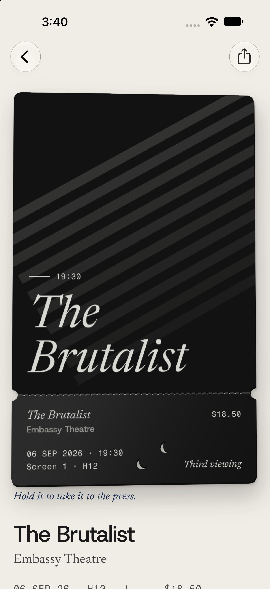
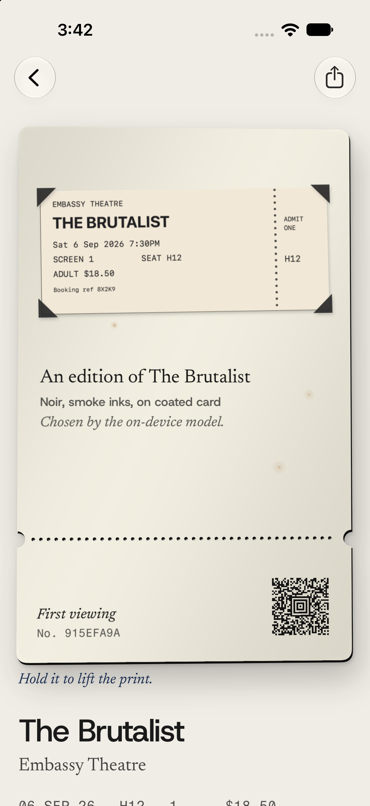
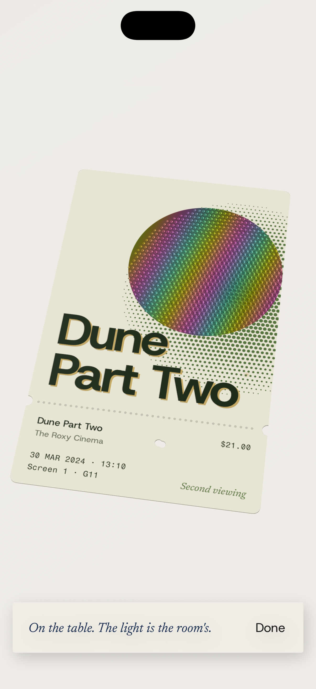
</p>

<sub>A third viewing, punched twice · six years in the drawer · on a table, lit by the room (the simulator's stand-in). <a href="docs/screenshots/day-30-clip.mp4">The moving share</a>.</sub>

---

## Tuned by hand

Every number here was set on purpose, and most were tuned by eye and thumb. The ones marked *device* still need a real phone to confirm the feel.

| | Value | Why |
|---|---|---|
| A stub's tilt | −1.5° to 1.5°, never 0, fixed when filed | Nothing on the table sits level |
| Press spring | response 0.34, damping 0.55 | Overshoots about a fifth once, then settles: a stamp pressed too hard |
| Reduce Motion | response 0.26, damping 1 | Critically damped, no overshoot, no tilt |
| The card's lean | up to 11° from the phone's attitude | Smoothed at 0.22 so the light follows the hand, not its tremor |
| The stock under a finger | sharpness 0.15 cotton → 0.85 holographic | Paper feels dull, metal bright *(device)* |
| The wheel | 30° a take, a detent at the stock's sharpness | The wheel feels like the paper it prints on *(device)* |
| A flick | coasts at 0.93 per 16 ms above 0.25°/ms | Then settles on the nearest take with one overshoot |
| Detents | a ratchet when they come faster than one per 28 ms | Single clicks at that speed blur into mush *(device)* |
| A ghosted part | 18% of its ink, drawn toward the stock | Only the part in hand reads |
| Separations | 52° back, −24° turned, 38 pt a sheet | A printer's view of the card's layers |
| The lever | 150 pt of travel, gives at 92%, resistance 0.1 → 0.8 | Committing is physical; there is no Save button *(device)* |
| Wet ink | dries over 2.4 s, then the timeline stops | The one thing that moves on its own, and it ends |
| A proof | about 120 bytes | A few numbers laid over an edition, not a picture of one |
| A punch | 16 pt across, 3 pt clear of any word | Smaller and a cut shape reads as a printed glyph |
| Patina | warmth 0.42 (1 − e^(−years/4.5)), foxing from the first year, one spot every eighteen months, seven at most | Quick at first, then hardly at all; rare |
| The card on a table | 64 × 102.4 × 0.4 mm, maps at 2.5 px a point | A playing card's size; cut in 0.8 s in a Debug build *(device)* |
| The moving share | 3 s at 60 fps, tilt −0.35 → 0.35, HEVC | About 1.6 MB; drawn in 10 s in a Debug build, when a destination asks for it |

## How it's built

| | Apple technology | In Stub |
|---|---|---|
| **Read** | Vision `RecognizeDocumentsRequest`, `RecognizeTextRequest` | The printed lines, in reading order |
| **Crop** | `DetectDocumentSegmentationRequest`, `DetectRectanglesRequest`, Core Image | The card is the ticket, not the table it lay on. Two detectors, because one lies in the simulator ([ADR-007](DECISIONS.md#adr-007--two-detectors-for-the-crop-and-a-quadrilateral-that-hugs-the-frame-is-not-a-ticket)) |
| **Understand** | Foundation Models: `@Generable`, streamed snapshots | The model reads with the rules' draft as a hint; the rules are the floor ([ADR-001](DECISIONS.md#adr-001--the-heuristic-parser-is-the-floor-the-model-is-measured-against-it), [ADR-010](DECISIONS.md#adr-010--the-model-reads-with-the-heuristics-draft-in-hand-and-is-scored-in-the-drawers-shapes)) |
| **Say** | Foundation Models | One dry sentence about the drawer: the numbers are counted by hand, only the phrasing is the model's, and the sentence is judged on the way out ([ADR-011](DECISIONS.md#adr-011--the-season-is-counted-by-hand-and-only-phrased-by-the-model)) |
| **Look** | Metal `[[stitchable]]` shaders in SwiftUI | Silkscreen and misregistration on flat parchment, specified at the modifier boundary so Metal is an implementation, not the identity ([ADR-002](DECISIONS.md#adr-002--the-look-is-specified-in-swiftui-first-metal-is-an-implementation-not-the-identity)) |
| **Print** | `@Guide(.anyOf(…))`, Metal, Core Motion, Core Haptics | The model art-directs from a closed vocabulary; the hash draws; one light ([ADR-015](DECISIONS.md#adr-015--every-release-gets-an-edition-the-hash-draws-it-the-model-art-directs-it-from-a-closed-vocabulary)) |
| **Press** | SwiftUI `Canvas`, `projectionEffect`, Core Haptics | Parts, takes, in-betweens, separations; a proof is a diff ([ADR-016](DECISIONS.md#adr-016--the-press-a-proof-is-a-diff-over-the-edition-and-every-part-has-its-own-die)) |
| **Place** | RealityKit, ARKit, a RealityKit surface shader | The card on a real table, lit by the room; holographic film from the real view direction ([ADR-018](DECISIONS.md#adr-018--the-rooms-light-on-a-real-table-the-card-is-lit-by-the-room)) |
| **Share** | `ImageRenderer`, AVFoundation | The still, and three seconds of the card turning in the light, drawn frame by frame through the same shaders |
| **Keep** | SwiftData, an App Group | On the device, no account, no network ([ADR-005](DECISIONS.md#adr-005--private-by-construction), [ADR-012](DECISIONS.md#adr-012--one-drawer-in-an-app-group-the-app-writes-it-the-widget-reads-it-an-intent-runs-inside-the-app)) |
| **Reach** | App Intents, WidgetKit, VisionKit | "Log a stub in Stub"; the last stub on the lock screen; live text from the camera |
| **Access** | VoiceOver, Dynamic Type, Reduce Motion | Every card says what it knows; one column at the accessibility sizes; a rotor for the parts of a poster; the wheel is one adjustable control ([ADR-013](DECISIONS.md#adr-013--the-table-is-two-columns-until-the-type-gets-large-at-the-accessibility-sizes-it-is-one)) |

---

## Built in the open

One day at a time, each day proved by a screenshot of the real app running in the simulator. The plan is in [`PLAYBOOK.md`](PLAYBOOK.md), the decisions in [`DECISIONS.md`](DECISIONS.md), the rules for the look in [`DESIGN.md`](DESIGN.md), and what actually happened each day, failures included, in [`docs/LOG.md`](docs/LOG.md).

| Day | Shipped | Proof |
|---|---|---|
| 0 | The skeleton: the model, the reader, two parsers, the look, the table, the seed path | 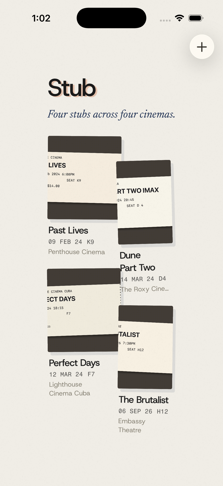 |
| 1 | The look moves to Metal; the reader crops the ticket out of the photograph | 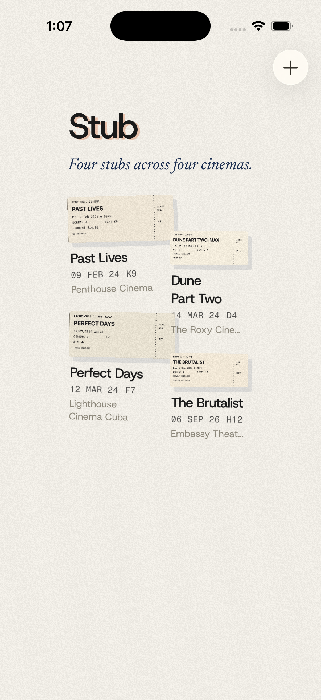 |
| 2 | The zoom transition, press physics, hold to lift the silkscreen | 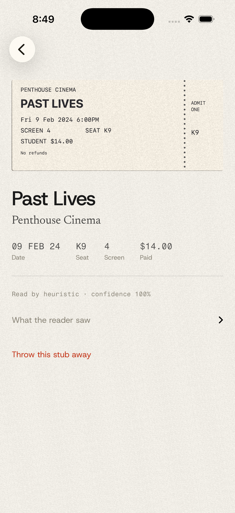 |
| 3 | The model streams, reads with a hint, and is scored; the eval harness | 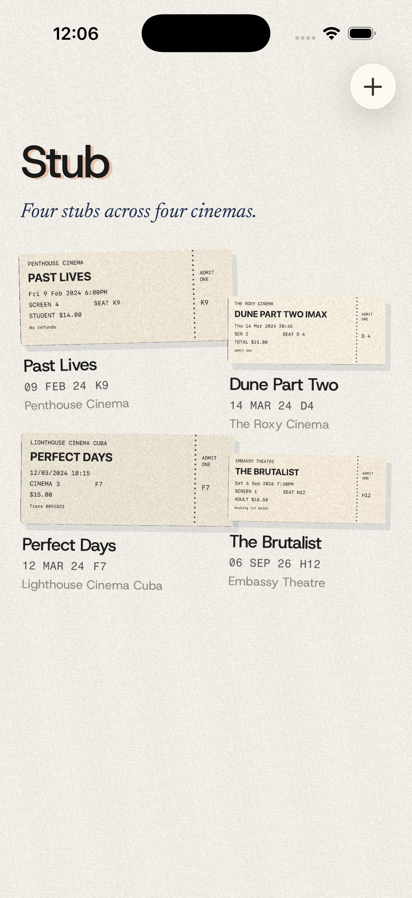 |
| 4 | The season sentence, counted by hand and phrased by the model | 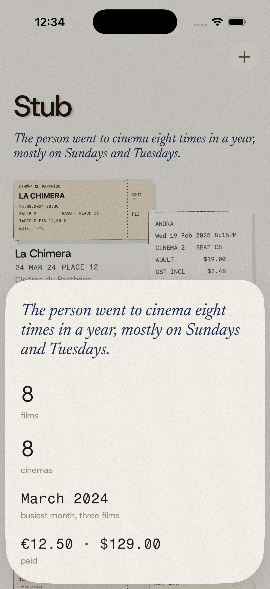 |
| 5 | App Intents, the widget, the drawer in an App Group | 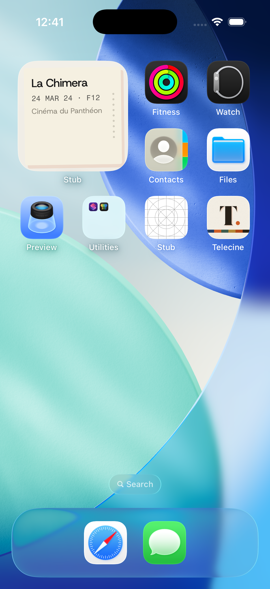 |
| 6 | The camera path, the icon, the accessibility pass | 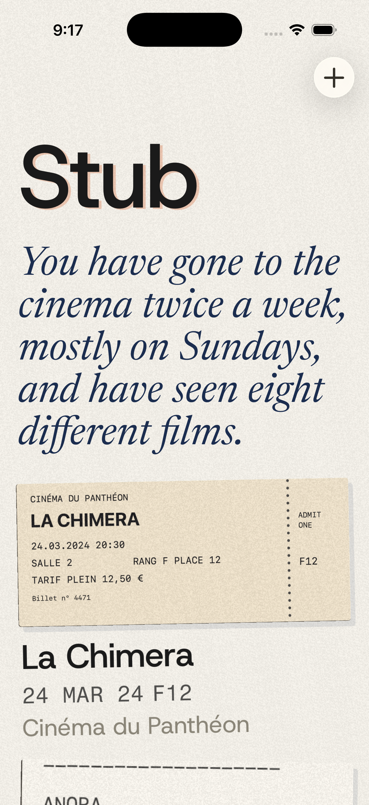 |
| 7 | The write-up, [`docs/post.md`](docs/post.md), `v0.1.0` |  |
| 21 | Editions: eight movements, three shaders, the art director, the card in the hand | 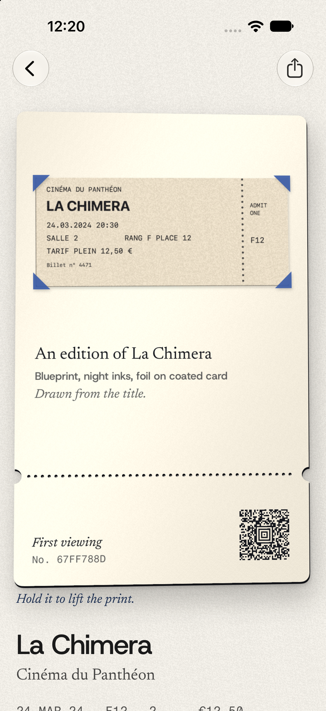 |
| 22 | Day 21 built: 2,600 lines written without a compiler, with one warning between them |  |
| 23 | Parts, takes and the proof ([the brief](docs/briefs/the-press.md)) | 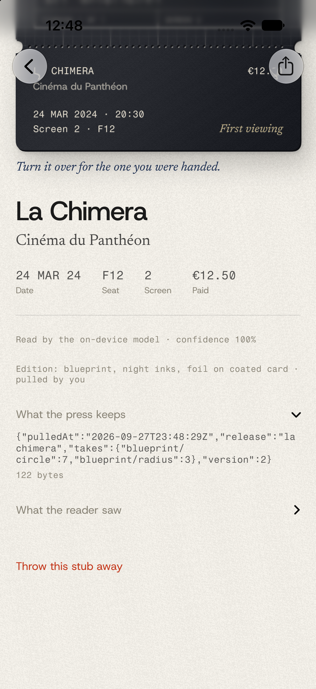 |
| 24 | The press room, the wheel, the in-betweens |  |
| 25 | Separations |  |
| 26 | The fan of movements, the draw-downs that flood the card, the swatch book | 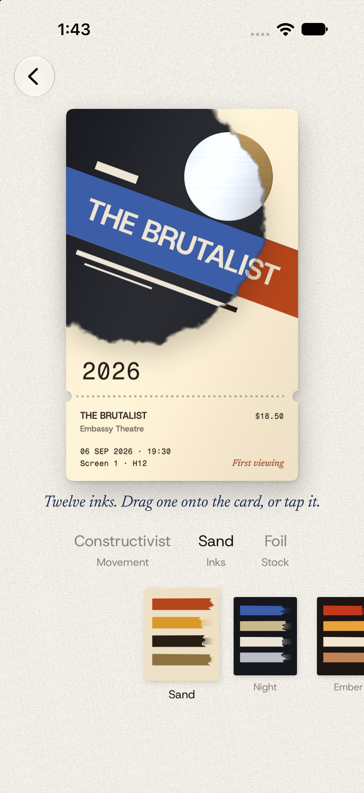 |
| 27 | The lever and the platen, wet ink, undo, and the back: signed, A/P, the takes in pencil | 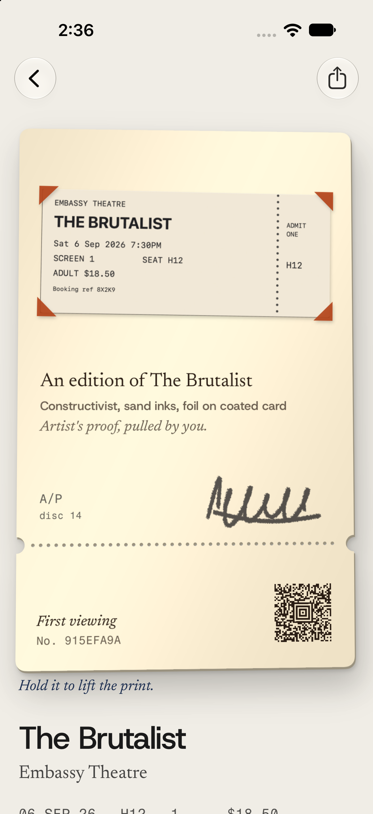 |
| 28 | The punch and patina: a remarque for every viewing after the first; the card ages from the night |  |
| 29 | The room's light: the card on a real table, lit by the room ([ADR-018](DECISIONS.md#adr-018--the-rooms-light-on-a-real-table-the-card-is-lit-by-the-room)) |  |
| 30 | The moving share, and the write-up, [`docs/post-press.md`](docs/post-press.md) | 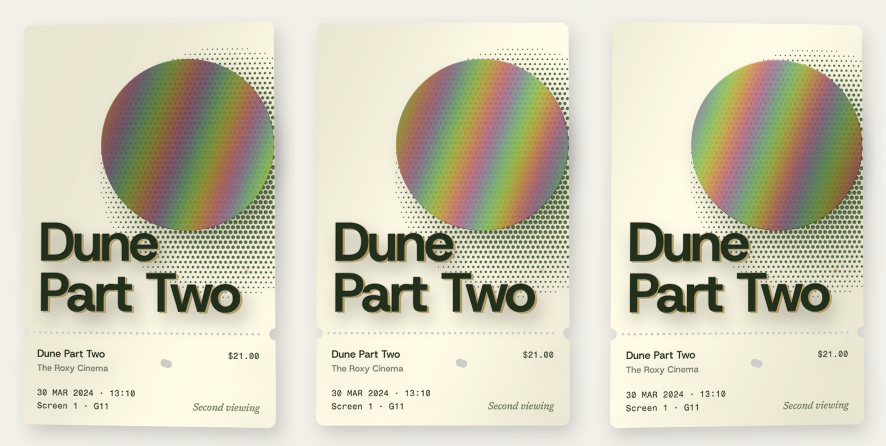 |

## Run it

You need Xcode 27 with an iOS 27 simulator (the app still targets iOS 26; [ADR-014](DECISIONS.md#adr-014--the-simulator-is-ios-27-the-app-still-targets-ios-26)) and [XcodeGen](https://github.com/yonaskolb/XcodeGen) (`brew install xcodegen`). Turn Apple Intelligence on for the Mac to use the on-device model.

```bash
git clone https://github.com/brunohart/stub && cd stub
scripts/build.sh      # xcodegen, then a simulator build
scripts/test.sh       # 113 tests on an iPhone 18 Pro; the eval suite asks the model for a few minutes
scripts/run.sh --seed --reset --wait-for "written|hand-counted" --shot docs/screenshots/now.png
```

The simulator has no camera, no gyroscope and no hands, so `run.sh` stands in for them:

| Flag | Does |
|---|---|
| `--seed --reset` | Runs the nine synthetic stubs in `fixtures/` through the real crop, Vision and parsers |
| `--edition [--open "Title"]` | Opens a stub so its edition is chosen and printed; `--turned` shows its back |
| `--tilt x,y` | Holds the light where a screenshot wants it |
| `--press --part disc --take 14` | Carries the card into the press and turns a part; `--scrub 13.5` holds an in-between |
| `--separated 0.8` | Pulls the card's layers apart |
| `--proof "disc=14,bars=3"` | Pulls a proof; `--keeps` shows what the press keeps |
| `--bench movement` · `--flood 0.4` | Opens the fan, the draw-downs or the swatch book; holds a flood part-way |
| `--pulled --wet 0.6` · `--signed` | Pulls the proof on the press and holds the ink wet; signs with a fixture signature |
| `--viewings 3` · `--age 6` | Punches the card as a third viewing; ages it six years |
| `--room` | Sets the card on a table (the simulator has no camera, so the table is a stand-in) |
| `--clip out.mp4` | Draws the moving share and copies it out |
| `--drive [--record out.mov]` | Plays the interactions on a clock, and films them |
| `--type accessibility-extra-large` | Sets Dynamic Type for the run |

On a phone, once the account is set up ([`docs/device.md`](docs/device.md) §1):

```bash
scripts/device.sh     # a signed Release build, installed and launched on the paired iPhone
scripts/archive.sh    # archive and export for TestFlight; --upload sends it to App Store Connect
```

## What the readers score

A test runs every fixture through the real pipeline and writes [`docs/evals.md`](docs/evals.md). The run of 29 September 2026, on the iOS 27 simulator, with the ninth fixture (a second Dune Part Two, printed IMAX):

| Field | rules | model, cold | model + the rules' draft |
|---|---|---|---|
| title | 9/9 | 9/9 | 9/9 |
| cinema | 9/9 | 8/9 | 9/9 |
| date | 9/9 | 8/9 | 9/9 |
| screen | 9/9 | 8/9 | 9/9 |
| seat | 9/9 | 9/9 | 9/9 |
| price | 9/9 | 2/9 | 9/9 |

The rules take about a millisecond. The model took 5.7 s (median) with the hint and 6.0 s cold on this run; three runs that day had medians from 2.5 s to 17.7 s on the same Mac. Cold, it reads a `$` as US dollars. Given the rules' draft, it matches them on every field. It isn't the same reader twice, so the table is a sample, and the log records the runs that scored differently.

## Honesty

On Day 0 the on-device model said it was available and then refused every request. The rules filed every fixture anyway, and that is why they are the floor and why every stub records who read it. On Day 1, Vision's document segmentation confidently returned a strip of table for every ticket, and a plain rectangle detector became the second floor. Day 21's editions were written on a machine with no Swift compiler and judged in a browser. They compiled on the first try on Day 22, and the log says what that session did and didn't catch.

What isn't proved yet: the camera, the Siri phrases, the lock-screen widget, the card on a real table, and everything you feel rather than see (the gyroscope, the haptics, the wheel's detents, the foil in moving light) need a signed build on a phone. The model art-directed its first editions in the simulator on Day 28 (The Brutalist as noir, La Chimera as constructivist), but its latency swings from about two seconds to about eighteen between runs on the same Mac, so plenty of editions still fall back to the hash after twelve seconds. Each day's log ends with a "Still rough" paragraph.

## Licence

MIT for the code. The fonts are Host Grotesk, Newsreader and Fragment Mono, under the SIL Open Font License, in `Stub/Resources/Fonts`.
