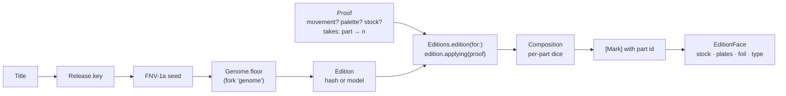

# The press

A brief for Claude Code, working in `brunohart/stub`. It adds one thing to Stub: a place where the person who kept a stub can pull their own proof of its edition. Everything in it is Swift, SwiftUI, Metal, Core Haptics, Core Motion, PencilKit and, at the end, RealityKit and ARKit. No network, no dependencies.

Written 2026-09-28 against `main` at `cc0c32e` (editions merged, Day 21). Suggested home in the repo: `docs/briefs/the-press.md`, with the feel prototype beside it as `docs/briefs/the-press-prototype.html`.

---

## 0. Read first, in this order

1. `DESIGN.md`, all of it, especially *Editions* and *What this is not*.
2. `DECISIONS.md`, especially ADR-001, 002, 005, 006, 009, 011 and 015.
3. `PLAYBOOK.md`: the ritual at the top, and Day 21.
4. `docs/LOG.md`: the Day 21 entry. **Day 21 was written without a compiler and has never been built.**
5. `Stub/Edition/`: `Release.swift`, `Edition.swift`, `Composition.swift`, `Marks.swift`, `Movements/*`, `EditionFace.swift`, `Keepsake.swift`, `ArtDirector.swift`, `Attitude.swift`, `Texture.swift`; then `Stub/Shaders/Edition.metal` and `docs/editions/edition.js`.
6. This brief.

The playbook's first rule applies before anything here: if the floor is not green, making it green is the day's first job. Day 21 has never been compiled, so the first day of this brief builds it.

---

## 1. The idea

**You shoot takes; you pull proofs.**

An edition is drawn by the hash and art-directed by the model (ADR-015). The press gives the person the same power the model has, and one more: for any part of the poster, they can ask the press for another drawing of that part and keep the one they like. They choose between drawings. **They never move a mark.**

This is the rule that keeps the press premium. There is no colour picker, no free drag, no text field, no sticker. The person does what a director does with takes and a printer does with proofs: they choose. Every choice stays inside the closed vocabulary and the seeded composition, so an edition can never become ugly in a new way (ADR-015's reason, extended to a third director).

The engineering that makes it possible is already in the repo and just tested: `Dice.fork`. A part rolled from its own forked die can be re-rolled without moving any other part. The press exposes that property directly to the hand. That is the design-engineering story, and every interaction below comes back to it.

What is stored is a **proof**: a few bytes of difference laid over the edition. It is not an image. The same proof prints the same card on every phone, forever.

---

## 2. What exists, so you build on it and not beside it

| Exists | Where | The press uses it for |
|---|---|---|
| Release key, FNV-1a seed, SplitMix64 `Dice`, `fork` | `Release.swift` | every take |
| `Edition` (movement, palette, stock, seed, `Director`) and `Genome.floor` | `Edition.swift` | the thing a proof is laid over |
| `Composition` → `[Mark]`, a pure function of edition and copy | `Composition.swift`, `Marks.swift` | parts, in-betweens, hit-testing |
| Eight movements, each a `Composer` extension | `Movements/` | parts are declared here |
| `EditionFace`: stock, two plates, foil, type, each its own layer; `printed` counts passes | `EditionFace.swift` | separations, the print run, isolation |
| `stock`, `relief`, `foil` shaders, one `Light` | `Edition.metal` | wet ink, patina, the flood |
| `Keepsake`: tilt (Core Motion + finger), `Texture` (Core Haptics), turnover, press run | `Keepsake.swift`, `Attitude.swift`, `Texture.swift` | the card on the press bed, the swatch book |
| `Editions.shared` + `EditionCache` | `ArtDirector.swift` | the single seam where a proof is applied |
| `DebugDrive`, `run.sh` flags | `App/DebugDrive.swift`, `scripts/` | proving every day in the simulator (ADR-009: extend it, never add a third mechanism) |
| `docs/editions/edition.js` + `specimen.html` | `docs/editions/` | the JS mirror; it must move in lockstep |

---

## 3. House rules this brief does not bend

- **The press room is the app's chrome, not an edition.** It is parchment (`Paper()`), `Ink` tokens, the three faces (ADR-006), one Newsreader italic sentence per screen. No dark deck, no glass, no tracked uppercase mono labels, no eyebrows (DESIGN › *What this is not*). The web prototype's chrome breaks all of these; it is a reference for feel only (§13).
- **Closed vocabulary.** The person chooses movement, palette and stock from the same `Genome` lists the model uses, and takes from the same dice. Nothing else.
- **The model never touches composition**, and the person never touches coordinates.
- **Nothing moves on its own.** One light, the phone's. The only time-based effect in this brief is wet ink drying after a pull (§5.7), which is the consequence of an act and ends. Write that exception into the ADR.
- **No network** (ADR-005). Proofs, the signature and exports stay on the device.
- **Reduce Motion, VoiceOver, Dynamic Type and 44pt targets** are part of every interaction's spec below, not a separate pass.
- **`edition.js` rolls the same dice in the same order as the Swift.** Every change to a movement lands in both, in the same commit.
- **Swift 6, complete strict concurrency, iOS 26 deployment target, iOS 27 simulator** (ADR-014). `project.yml` is the project (ADR-004): Info.plist keys and targets are edited there.
- **API names in this brief are starting points.** The SDK on the Mac is the authority. Where an API is not what this brief says, adapt and record the finding in the log, as Day 3 did.
- **Every day ends with the playbook's ritual**: build, green tests, a screenshot from `run.sh`, a `LOG.md` entry, small Conventional commits (`feat(press): …`), and the Linear issue if the slot uses one.

---

## 4. Architecture: a proof is a diff



### 4.1 Parts, each with its own die

Today each movement rolls one die in sequence (`var d = dice("constructivist")`). Re-rolling anything re-rolls everything after it. The press needs **parts**: named groups of marks, each rolled from its own die.

- A `Part` has an `id` (stable, namespaced by movement: `"constructivist/disc"`), a spoken `name` ("the disc"), and a `kind`: `.frame` or `.piece`.
- Each movement declares its parts in order. Every `Mark` on the poster carries the `Part.ID` it belongs to. Strip marks carry none: the strip prints facts, and facts have no takes.
- **The dependency rule.** Each movement has at most one frame part: the geometry the others hang from. A piece may read only its own die and the frame's outputs. A frame may read only its own die. So turning the frame may move every piece hanging from it, and turning a piece moves that piece and nothing else. This is the property the whole press depends on, and a test enforces it (§9).
- **Worked example, constructivist.** Today one die rolls the sign, angle and centre (the diagonal), then the circle, then three bars. Split it:
  - `diagonal` (frame): sign, angle, band width, centre. Draws the band.
  - `disc` (piece): radius and height; its side comes from the frame's sign.
  - `bars` (piece): the three bars' offsets and widths, turned with the frame.
  - The title is set by `Setting.fit` into the band and rolls nothing, so it is not a part the person can turn. The year rolls nothing either.
- Do the same for all eight. The obvious frames: swiss's grid variant, deco's axis, cutout's field, riso's screen, letterpress's margins, blueprint's grid, noir's blind. The obvious pieces include riso's `register` (how far the ghost title sits out of register), so the house misregistration becomes something you choose by take instead of by drag. Name each part from its movement's own vocabulary, and write every movement's list into the doc comment on its function.

### 4.2 Takes

- A take is a non-negative integer per part. **Take 0 is the part's own die**, the drawing as it comes from the title. Take *n* is `base.fork("take \(n)")`.
- One function builds a part's die, so no movement can do it differently: `func dice(_ part: Part.ID, take: Int) -> Dice`.
- Takes are keyed by the namespaced part id. Switching from constructivist to riso and back keeps the constructivist takes.
- Range: 0 to 99. A person who wants take 100 wants a different movement.

### 4.3 The proof

```swift
struct Proof: Codable, Equatable, Sendable {
    var release: String
    var movement: Movement?        // nil: the edition's own
    var palette: Palette?
    var stock: Stock?
    var takes: [String: Int]       // part id → take; absent means 0
    var pulledAt: Date?            // nil while it is still on the press
    var version: Int               // the Genome version it was pulled against
}
```

- `ProofCache` sits beside `EditionCache`: one JSON dictionary in `UserDefaults` keyed by release, never pruned. The privacy manifest already declares `UserDefaults` (CA92.1).
- **One seam.** `Editions.edition(for:)` returns `edition.applying(proof)`. The detail, the print run after Keep and the share all get the proof without knowing it exists.
- `Director` gains `.you`. An applied proof with any difference makes the edition `directedBy: .you`; the edition underneath keeps its own director, so going back is exact.
- **Going back is deleting the proof.** Nothing is overwritten. "Back to the title's edition" or "Back to the model's edition", worded from whoever directed the edition underneath.
- The detail gets a third disclosure in the existing pattern (DESIGN rule 7, beside "What the reader saw"): **"What the press keeps"**, which shows the proof's JSON and its size in bytes. Honest machinery, and the best evidence of the idea: a whole poster in about sixty bytes.

### 4.4 The version decision (write it into ADR-016)

Splitting movements into parts changes every composition, so every edition would draw differently. ADR-015 says an edition already printed never reprints itself. The honest call:

- `Genome.version` becomes 2. `Genome.floor` is unchanged: it forks `"genome"`, so every release keeps its movement, palette and stock. `floorIsPinned` stays green without edits.
- Stub has never shipped: no TestFlight, one phone. So v1's arrangement is **retired**, not frozen. A cached v1 edition is redrawn at v2 on first sight, with a log line saying so. The ADR records that this was allowed because nothing had shipped, and that once the app ships, a change like this needs a frozen path for the old version.
- A v2 golden pins the first marks of three fixtures' compositions, computed by `edition.js` under Node on the Mac, the way Day 21's goldens were computed by a mirror.

### 4.5 In-betweens

The wheel does not cut from take 13 to take 14. It draws the space between them.

- `Composition.between(_ a: Composition, _ b: Composition, t: CGFloat) -> [Mark]`. Pair marks by `(part, index within part)`. Paired marks of the same shape interpolate: rects, circles, rings, lines and polygons with equal point counts by their numbers; turns by angle and centre; words by position, size and turn; halftones by focus, reach and step. Unpaired marks, or pairs whose shape or text differs, cross-fade by `t`.
- Only the part being turned changes between two takes, so only its marks interpolate. The rest of the poster stands still while the disc glides. This is the dependency rule, made visible.
- `between(a, b, 0) == a.poster` and `between(a, b, 1) == b.poster`, and a test says so.
- Performance: build the compositions for takes *n* and *n+1* once each (extend `CompositionMemo` to keep the pair). Per frame, only interpolate and draw. The target is no dropped frames at 120 Hz during a scrub on a ProMotion iPhone: add `CADisableMinimumFrameDurationOnPhone: YES` to the app's Info.plist in `project.yml`, and check with Instruments' Hitches and SwiftUI templates. If a mark kind cannot hold the frame rate (the halftone's dot path is the likely one), cache its path by parameters or let it cross-fade. Record which in the log.

---

## 5. The press room

### 5.1 Getting there

- From the detail's front face: **press and hold the card** until it lifts (scale 1.03, the shadow deepens and falls further, a light impact), then it carries on the zoom transition into the press room and lies flat on the bed. The existing tap still turns the card over, and the drag still tilts it.
- For discoverability, the detail's italic line alternates as it already does. When the card has never been to the press, it reads "Hold it to take it to the press."
- VoiceOver: an accessibility action on the keepsake, "Take it to the press".
- The press room is a full-screen view, not a sheet, with its own zoom transition from the card.

### 5.2 The room

One screen, portrait, parchment.

- **The bed** takes the top two-thirds. The card lies on it at the largest size that fits, lit by the phone as in the keepsake (`Attitude`, `Light`, `EditionFace`). It does not lean in the press room; the light still moves. The bed is where you point.
- **The bench** takes the bottom third and changes with what you are holding:
  - Nothing selected: the three genome choices, **Movement · Inks · Stock**, as three plain words in Host Grotesk. The chosen one shows its object (§5.4 to §5.6). This is the bench at rest.
  - A part selected: **the wheel** (§5.3).
- **The lever** runs down the right edge of the bed (§5.7).
- **The italic sentence** is the status line and the only italic on the screen: "The disc. Take fourteen." / "Riso, moss inks, on holographic film." / "Pull it when it is right."
- Close with the system back gesture or a plain "Done". Leaving without pulling keeps the proof on the press (unpulled, `pulledAt == nil`), so the next visit continues where you stopped. The detail keeps showing the last pulled proof.

### 5.3 Isolate a part, then turn the wheel

**The hand.** Touch a part on the card. Everything else knocks back to a ghost (about 18% of its ink, desaturated toward the stock) and the chosen part stays in full ink. The bench becomes the wheel. Turn it. The part redraws through its in-betweens under your thumb, a detent per take, while the rest of the poster stays still. Let go and it settles on the nearest take. Touch the bare stock, or the chosen part again, to put it down.

**What it means.** Only the part you are holding moves. The ghosting shows it; the in-betweens prove it.

**How it is built.**
- Hit-testing: the touch point in card space against each mark's shape, topmost plate first, turned marks inverted through their `Turn`. Words hit by their measured box. A touch that lands on no part selects nothing.
- Ghosting: `Printer` takes an optional `focus: Part.ID?` and draws unfocused marks with reduced opacity and a desaturated ink. No shader is needed.
- The wheel is a SwiftUI view: a knurled ring with sixty ticks (every fifth one long), a notch at twelve o'clock, and the take in Fragment Mono at the centre. Drag rotates it by the change in angle about its centre. Flick it and it coasts with friction, then settles to a detent on a spring. Past take 0 it resists at 0.3×. A frame part's wheel says so in the italic line: "The diagonal. Everything on it moves with it."
- Detents: a Core Haptics transient per take, with sharpness equal to `stock.sharpness`, so the wheel feels like the paper, and intensity rising with angular speed. Above one detent every 28 ms, individual clicks blur, so switch to a short continuous event at the same sharpness: a ratchet, not mush. Put this in `Texture` or a sibling, so the stock's haptic vocabulary stays in one file.
- Parts that roll nothing (constructivist's title, for example) cannot be selected. Touching one says why in the italic line: "The title is set by the band. Turn the diagonal."

**Accessibility.** Parts are reachable through a rotor on the card, `accessibilityRotor("Parts")`, one entry per part: "The disc, second ink, take three". The wheel is one adjustable element (`accessibilityAdjustableAction`): swipe up for the next take, down for the previous, and the value is read as "Take fourteen, of ninety-nine". Keyboard arrows move a take. Reduce Motion: no in-betweens and no coasting; the part cuts at each detent.

### 5.4 Separations: the card comes apart

**The hand.** Pinch outward on the card. It tilts back and its layers lift apart in depth: stock at the bottom, then the first plate, the second plate, the foil and the type, each a sheet of film with only its own ink on it. Tilt the phone and you look between them. Touch a mark on any sheet to select its part: parts that were hidden under others on the flat card are now reachable. Pinch in and the sheets press back together with one heavy impact: the press closing.

**What it means.** A printed card is layers of ink. Seeing them separated is how a printer thinks, and it solves a real problem: on the flat card, overlapping parts are hard to touch.

**How it is built.**
- The layers already exist as separate views in `EditionFace`. Separation is one parameter from 0 (flat) to 1 (apart). Each layer gets a `projectionEffect` with its own `CATransform3D`: a shared tilt (about 52° about x, −24° about z), perspective (`m34` about −1/900), and a translation in z of `index × spread`, with spread up to about 38pt. `MagnifyGesture` drives it and a spring finishes it.
- Plates render on a clear ground when separated, so each sheet shows only its own ink, with a hairline edge in the ink's colour at 20% so the film reads as film.
- Hit-testing on a separated sheet: do not trust SwiftUI's hit-testing through `projectionEffect`. Unproject the touch through each sheet's transform onto its plane, from the top sheet down, and hit-test marks in card space as in §5.3.
- Light: each sheet keeps its shaders. The foil sheet still catches the light.

**Accessibility.** Separations is also a button in the bench ("See the plates"). The rotor from §5.3 already reaches every part, so separations adds no information VoiceOver needs. Reduce Motion replaces the 3D spread with the layers laid side by side in a flat row, each tappable.

### 5.5 Movement: the fan

**The hand.** Choose Movement on the bench and this release rises in all eight movements, fanned in an arc like a hand of cards: your palette, your stock, this film's title and your strip. Slide a finger along the fan and the card under it lifts and grows, with a selection tick as each card passes. Let go on one and it flies to the bed; the bed prints it pass by pass, quickly.

**How it is built.**
- A custom `Layout`, `FanLayout`, arranges cards on an arc (radius about 520pt, about 60° of arc) and magnifies by distance from the finger, the way the Dock magnifies. The eight compositions are built once when the fan opens.
- The card the title's hash chose and the card the model chose (when it did) carry a small note underneath in Host Grotesk grey: "drawn from the title", "the model's". Honest machinery.
- The chosen card moves to the bed with `matchedGeometryEffect`. The print run is the existing one from `Keepsake.press()`, with passes about 180 ms apart instead of 420: a proof is pulled quicker than an edition is printed.

**Accessibility.** Eight buttons, each read as "Deco. Symmetry, a sunburst, stepped frames." (the words already in `Vocabulary.glossary`, cut to the first clause). Reduce Motion: no magnification spring, and the chosen card cross-fades onto the bed.

### 5.6 Inks and stock: draw-downs and the swatch book

**Inks.** A printer tests an ink with a **draw-down**: a smear of it pulled across paper with a knife. The twelve palettes are twelve draw-downs in a snapping horizontal rail (`scrollTargetBehavior(.viewAligned)`, with the centred one slightly larger through `scrollTransition`). Each shows its four inks pulled across its own ground. **Drag a draw-down onto the card**, and the new inks flood outward from where you let go: a spreading edge, slightly irregular like ink wicking into paper, across every layer at once, in about 0.55 s. Tapping a draw-down floods from the card's centre.
- The flood: the card in the new palette is laid over the card in the old palette and revealed by a `colorEffect` whose alpha is a smoothstep on the distance from the drop point, with the edge pushed in and out by the stock shader's noise (about 10pt of wander). Cotton wicks a wider, softer edge; coated card a crisper one. When the flood covers the card, the old card is removed.
- VoiceOver: "Moss inks" and so on; the palette names are already words for feelings. Reduce Motion: a 0.2 s cross-fade.

**Stock.** The **swatch book**: four swatches of card, lit by the same light as the bed. **Press and hold a swatch and rub it** to feel it before you choose: this is `Texture` with that swatch's stock, driven by the finger's speed. Choosing by touch is the point. Tap to choose, and the card is reprinted on the new stock pass by pass (the stock is what everything is printed on, so changing it is a reprint).
- VoiceOver: "Cotton. Thick, soft, uncoated." (the doc comment on `Stock`). The hold-to-feel works under VoiceOver through a double-tap-and-hold passthrough.

### 5.7 The lever: pulling the proof

**The hand.** Along the right edge of the bed is a lever: a short rail with a handle. Pull it down. It resists more the further it goes, and you feel that resistance. Near the bottom it gives: the platen comes down, the card is pressed (a heavy impact, and the card compresses by about 1.5% for a moment). The impression rises into the stock as the relief deepens from nothing to its full depth. For a couple of seconds the new ink is wet: a gloss on the ink that follows the light and then dries away. Let go before the bottom and the lever springs back and nothing is pulled.

**What it means.** Committing is physical and deliberate. There is no Save button because nothing here is a document.

**How it is built.**
- Travel about 150pt. The resistance is one continuous haptic event on an advanced player whose intensity control follows the lever's travel (from about 0.1 to 0.8), at low sharpness. The pull commits at 92% of travel with a transient at intensity 1.0 and sharpness 0.3. Consider authoring the platen as an AHAP file in the bundle so the press's feel is a versioned asset.
- The platen and the impression are one `KeyframeAnimator`: a brief compress, then the relief `depth` from 0 to the stock's depth.
- Wet ink: a `wet` uniform (0 to 1) on `relief` that adds a tight specular gloss over inked areas, lit by `Light`. It is driven by a `TimelineView` **only while it is above zero**, decays exponentially over about 2.4 s, and then the timeline stops. Nothing runs at rest.
- The proof gets `pulledAt`, the detail shows it, and `Editions` publishes the change, so the table, the detail and the share all update.
- Undo: register each change on the press (take, movement, inks, stock, pull) with the environment's `UndoManager`, so shake to undo and three-finger undo work for free.

**Accessibility.** The lever is also an accessibility action, "Pull the proof", with no drag needed. The platen's haptic plays either way. Reduce Motion: the lever still travels (it follows the finger) but does not spring or overshoot, and there is no wet gloss.

### 5.8 The back is yours

The front is the film's. The back is where an owner writes.

- The first time a proof is pulled, the italic line says "Sign it on the back." Turn the card over. Below the mounted stub there is a margin. **Sign with a finger**: `PKCanvasView` with `drawingPolicy = .anyInput` and a graphite pencil tool. The signature is stored once (`PKDrawing.dataRepresentation()` in Application Support, not `UserDefaults`), used on every proof after, and can be redone with a long-press.
- In the same pencil, the printmaker's notation: **A/P**, for artist's proof, and the takes that differ from the title's ("disc 14 · bars 3"), set in Fragment Mono and drawn at graphite opacity with a multiply blend so they sit in the stock.
- Nothing is added to the front except what the strip already prints. DESIGN › Editions rule 6 holds: nothing invented. The signature is the person's own mark, and it sits on the person's side of the card.
- VoiceOver reads the back's pencil as "Signed, artist's proof, disc take fourteen."

### 5.9 The colophon, and the detail's honest line

`Edition.described` gains the director: "Constructivist, sand inks, foil on coated card. Artist's proof, pulled by you." The detail's machinery line reads "… · pulled by you" when a proof exists. The share includes the proof, because the share is rendered from `Editions`.

---

## 6. After the proof exists

These are not the press, but the proof makes them possible. Each is one day.

### 6.1 The punch: viewings through the card

A second viewing of a release punches the strip, the way a conductor punches a ticket. **Viewing *n* has *n − 1* punches.**
- A punch is a hole, subtracted from `TicketShape` the way the perforation is. The table shows through it, and **it goes through both faces**: the back shows the same holes, mirrored. Keep the back's Aztec code and the strip's text clear of every punch; compute the clear zones from the marks' bounds.
- The shape comes from the movement's vocabulary (a circle for constructivist, a stepped diamond for deco, a square for swiss, and so on) and the positions are rolled from `dice("punch/\(n)")` inside the clear zone, so they are the same on every phone.
- The punch is a copy fact (DESIGN › Editions rule 1): which viewing this was. It is not the design. The printmaker's word for a mark that distinguishes one impression from another is a **remarque**; use it in the doc comments.

### 6.2 Patina

The card ages from the night it was seen.
- `stock` gains an `age` uniform in years, clamped to ten. Age warms the ground slightly, adds rare foxing (small rust spots whose positions come from the seed and whose count grows with age), and softens the corners by lightening the stock near them.
- It is a function of `screenedAt` and the seed, so it is the same on every phone and it changes only as the calendar does. Age 0 is the identity, and a test says so.
- Nothing about the design changes. Patina is surface, like the stock (DESIGN › Editions rule 3).

### 6.3 The room's light

DESIGN says one light, and it is the phone's. Here, it is the room's.

- "Put it on the table" in the detail places the card, at real size, on a real surface through the camera (about 64 × 102 mm and 0.4 mm thick, with rounded corners and the perforation cut). The room's light falls on the foil.
- RealityKit: a thin rounded box (`MeshResource.generateBox(…, cornerRadius:)`). A `PhysicallyBasedMaterial` gets base colour from the card rendered flat, because the `-look swiftui` path already prints the inks without lighting; metallic from the foil layer's mask; roughness from the stock (cotton rough, foil smooth); a normal map from the inks layer as a height field, using the same height function as `edition_height`, computed once; and the perforation as `opacityThreshold`. Holographic film gets a `CustomMaterial` surface shader that ports the thin-film cosine from `foil`, using the real view direction.
- Prefer `RealityView` with spatial tracking. If environment texturing is not reachable from it, use `ARView` with `ARWorldTrackingConfiguration` and `environmentTexturing = .automatic`, wrapped in a representable. Gate on `ARWorldTrackingConfiguration.isSupported`. It is a device test; the simulator proves only that the entity builds.
- The camera usage string already exists. Nothing leaves the phone. Write it as ADR-017, because it amends DESIGN › Editions rule 4 for this one view.

### 6.4 The moving share

The Day 21 log names it: a still is the wrong share for a card whose point is light.
- Render a three-second clip: the card turning from −0.35 to 0.35 of tilt while the light crosses the foil, deterministic, 60 fps, HEVC via `AVAssetWriter`, frames from `ImageRenderer`. Offer it beside the still in the `ShareLink`.
- **Risk to confirm first:** that `ImageRenderer` draws the `colorEffect` and `layerEffect` shaders. The current still share already depends on this and it is unproved. If it does not, render frames through a Metal texture path instead, and record it in the log.

---

## 7. What the press does not do

- No colour picker, no free drag of marks, no editing the title or the strip. You choose between drawings.
- No new faces, no new movements, palettes or stocks. Growing the vocabulary is a `Genome` version, not a press feature.
- No sharing proofs between phones yet. A proof is sixty bytes and could travel by AirDrop as a custom `UTType` and print identically on another phone. It is worth doing; it is not this brief.
- No sound. Haptics punctuate (DESIGN rule 8).
- No ambient motion anywhere. No shimmer at rest.

---

## 8. Numbers to start from

Tune these by thumb on a device, and write the tuned values into the log.

| Thing | Start |
|---|---|
| Wheel: degrees per take | 30° |
| Wheel: coast | velocity × 0.93 per 16 ms; coasts above 0.25°/ms |
| Wheel: settle | `Motion.settle` to the nearest detent |
| Wheel: below take 0 | resistance 0.3× |
| Detent haptic | transient; sharpness = `stock.sharpness`; intensity 0.5 to 0.9 by speed; continuous above one per 28 ms |
| Ghosted parts | 18% opacity, desaturated toward the stock |
| Separations | tilt 52° about x, −24° about z; `m34` −1/900; up to 38pt per layer |
| Fan | radius 520pt, 60° of arc, lift 28pt, magnify 1.18 |
| Flood | 0.55 s; edge wander 10pt (cotton wider, coated crisper) |
| Proof print run | 180 ms per pass |
| Lever | 150pt travel; commit at 92%; resistance 0.1 to 0.8, sharpness 0.2; platen 1.0 / 0.3 |
| Platen | compress 1.5%, then relief depth 0 → full |
| Wet ink | decays over 2.4 s, then the timeline stops |
| Frame rate | 120 Hz on ProMotion (`CADisableMinimumFrameDurationOnPhone`) |

---

## 9. Tests that prove the idea

1. **Parts are independent.** For every movement, for every piece part, for takes 0 to 20: every mark outside that part is identical to take 0's. A frame part is exempt for its own dependants and nowhere else. This generalises `forksAreIndependent` from the die to the drawing. It is the most important test in the brief.
2. **Take 0 is the title's drawing.** A proof with no differences produces an edition equal to the one underneath, and `directedBy` is unchanged.
3. **In-betweens meet their ends.** `between(a, b, 0)` and `between(a, b, 1)` equal the two compositions' posters.
4. **Proofs round-trip.** Encode, decode, apply: the same composition.
5. **Going back is exact.** Apply a proof and delete it: the edition is the one before, including its director.
6. **v2 goldens.** The first marks of three fixtures' v2 compositions match numbers computed by `edition.js`.
7. **The floor did not move.** `floorIsPinned` passes unchanged.
8. **Punches clear the words.** For every movement and viewings 2 to 6, no punch intersects a strip mark or the Aztec code.
9. **Patina at age 0 is the identity.**

---

## 10. The days

Add these to `PLAYBOOK.md` as Day 22 onward, dated from the day this brief lands, so the scheduled slot can build them one a day, or work through them in one session. Each day ends with the ritual. New `run.sh` flags go through `DebugDrive` (ADR-009).

**Day 22: Day 21, built.** `scripts/build.sh`, fix every compile error in the editions, then `scripts/test.sh` green. Take Day 21's proof shots (`--edition --tilt 0.35,-0.25`, and `--turned`). Log what the compiler found. Nothing in this brief starts until this is green.

**Day 23: Parts, takes and the proof.** Data only, no new UI. Parts and per-part dice in all eight movements, `Mark.part`, `Genome.version = 2`, `edition.js` in lockstep and the specimen regenerated (commit v1 and v2 specimen screenshots side by side), `Proof`, `ProofCache`, `Director.you`, the `applying` seam, "What the press keeps" in the detail. Tests 1, 2, 4, 5, 6 and 7. Write ADR-016 and a new DESIGN.md section, *The press*. New flags: `--proof "disc=14,bars=3"` applies a proof at launch. Proof: the edition shot at take 0 and with the proof.

**Day 24: The press room, isolation, the wheel.** Entry from the keepsake, the room, the bed, ghosting, the wheel and its detents, in-betweens, the italic line, the rotor, the adjustable wheel. Test 3. Flags: `--press`, `--part constructivist/disc`, `--take 14`, `--scrub 13.5` (hold a fractional take for an in-between shot). Proof: shots at 13, 13.5 and 14, and a `-drive` clip of the wheel turning, `docs/screenshots/day-24-press.mov`.

**Day 25: Separations.** The pinch, per-sheet projection, unprojected hit-testing, the flat Reduce Motion row. Flag: `--separated 0.8`. Proof: the shot, and a clip of the card coming apart and pressing back together.

**Day 26: The fan, draw-downs and the swatch book.** `FanLayout`, the flood shader, hold-to-feel, the fast print run. Flags: `--bench movement|inks|stock`, `--flood 0.4` (hold the flood part-way). Proof: one shot per bench, and the flood held at 0.4.

**Day 27: The lever, wet ink and the back.** Lever and platen, the `wet` uniform, `UndoManager`, the signature, A/P and takes in pencil, the colophon and the detail's line. Flags: `--pulled`, `--wet 0.6`. Proof: the wet shot, and the back signed (a fixture signature drawn by `DebugSeed`).

**Day 28: The punch and patina.** Test 8 and test 9. Flags: `--viewings 3`, `--age 6`. Proof: a second viewing punched, and a six-year-old stub. The eight fixtures are eight different releases, so add a ninth to `scripts/make-fixtures.swift`: a second Dune Part Two ticket ("DUNE PART TWO IMAX", a later date, another seat), which also exercises `Release.key` folding the format away. Add its truth to `fixtures/expected.json` so the eval table stays whole.

**Day 29: The room's light.** ADR-017. The entity builds in the simulator; placing it is a device test (add it to `docs/device.md` §3).

**Day 30: The moving share, and the write-up.** Confirm `ImageRenderer` and shaders first. The clip in the share. `README.md`: the press row and the day table. `docs/device.md` §3: the press in the hand (the wheel's detents on each stock, the lever's resistance, the platen, wet ink under a real light, separations while tilting). Draft `docs/post-press.md` in the voice of `docs/post.md`, on one subject: re-rolling a part without moving the rest, from `Dice.fork` to the wheel.

---

## 11. Documents to write

- **ADR-016: The press. A proof is a diff over the edition; every part has its own die.** Covers parts and the dependency rule, takes, the proof, `Director.you`, the seam, going back, the v2 retirement of v1 and why it was allowed, in-betweens, and the wet-ink exception to "nothing moves on its own".
- **ADR-017: The room's light.** Amends DESIGN › Editions rule 4 for the AR view only.
- **DESIGN.md › The press**, in the style of *Editions*: you choose between drawings and never move a mark; the front is the film's and the back is yours; the press room is chrome; haptics are the stock's; one light, except the room's.
- `docs/LOG.md` every day, `docs/device.md` §3, `README.md`.

---

## 12. Lexicon

Use these words in type names, doc comments and copy. They are the craft's own words.

- **Take**: one drawing of a part. Film's word. Take 0 is the drawing that comes from the title.
- **Proof**: a trial impression, pulled to check the work. Here, the person's choices laid over the edition.
- **Artist's proof (A/P)**: an impression the artist keeps, outside the numbered edition.
- **Pull**: what a printer does to a proof. The lever pulls it.
- **Platen**: the flat plate that presses paper to type.
- **Separations**: an image split into one layer per ink, one plate each.
- **Draw-down**: a test smear of ink pulled across paper with a knife.
- **Swatch book**: samples of stock to see and feel.
- **In-between**: animation's word for a drawing between two key drawings.
- **Detent**: a felt click that marks a step on a continuous control.
- **Knock back**: to reduce something to a ghost so something else reads.
- **Remarque**: a small mark that distinguishes one impression from another. Here, the punch.
- **Patina**: the surface a thing earns by age.
- **Frame** and **piece**: this brief's words for a part that others hang from, and a part that hangs.

---

## 13. The web prototype

`the-press-prototype.html` is a single page built while this brief was being thought through. It proves one thing: the feel of a jog wheel scrubbing takes for one part while the rest holds still. It uses the repo's exact `Dice` and FNV (it reproduces `0x915efa9ae0edb7b8` for "the brutalist" and the published SplitMix64 sequence for seed 1).

What to take from it: the wheel's physics (degrees per detent, coast, settle, resistance past zero) and the "What Stub stores" readout, which becomes "What the press keeps".

What to leave: its poster is not `Composer.constructivist()` (its parts and rolls are its own), and its chrome is dark with tracked uppercase mono labels, which the house forbids. The press room is parchment.
