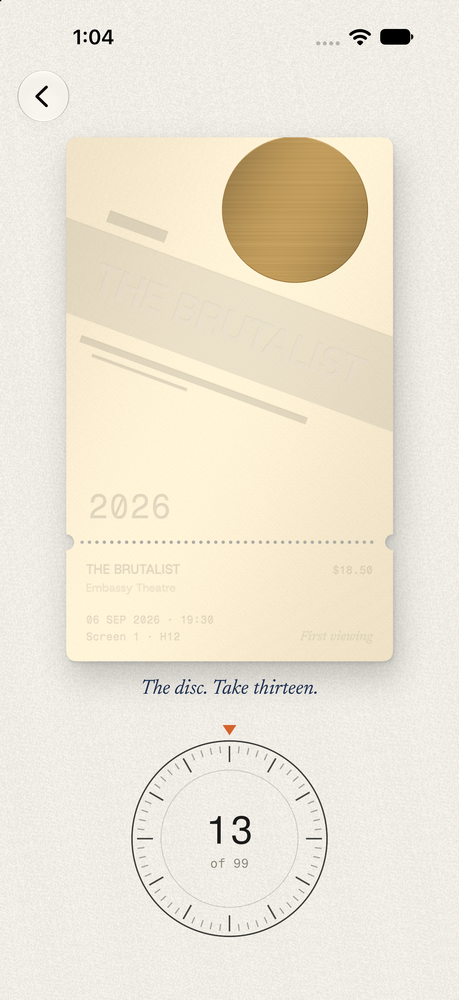
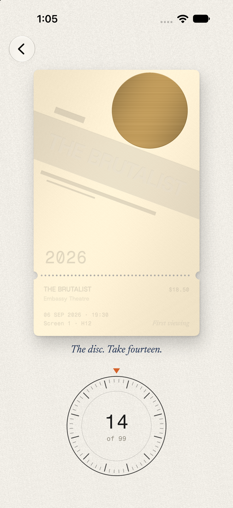
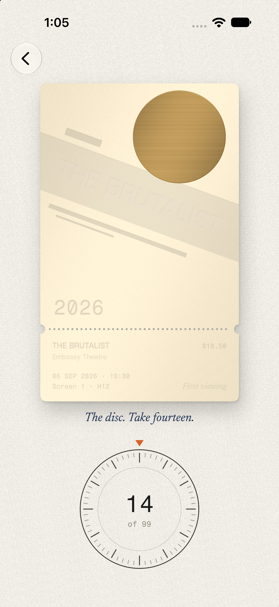

# Re-rolling one part of a poster without moving the rest

*Draft. Evidence first. Everything below is in the repo: the day-by-day is [`docs/LOG.md`](LOG.md), the decision is [ADR-016](../DECISIONS.md#adr-016--the-press-a-proof-is-a-diff-over-the-edition-and-every-part-has-its-own-die), the brief is [`docs/briefs/the-press.md`](briefs/the-press.md).*

Stub prints an edition for every film you keep a stub for: a ticket designed for the release, drawn by code from a closed vocabulary and seeded by the title, so every phone draws the same card. Then it gives you a press. Touch the disc on a constructivist poster and turn a wheel, and the disc redraws, take after take, while the band, the bars and the title stand still. You choose between drawings. You never move a mark.

That feature is one property of a random number generator, made visible to a thumb. This is how it got there.

<p>



</p>

## 1. One die is a queue

The first editions (Day 21) rolled everything from one seeded die, in order. The constructivist composer asked for the band's angle, then its width, then the disc's radius, then the bars. That is the natural way to write a generative drawing, and it has a property you only notice when you want to change one thing: every roll depends on how many rolls came before it. Give the disc one more number to roll and the bars get different numbers, because they are further down the same queue. The whole poster is coupled to its own reading order.

For a drawing nobody touches, that doesn't matter. For a press it's fatal: "another disc" would mean another poster.

## 2. Fork, don't advance

The die is SplitMix64, written into the app so that a change to the standard library can never reprint an edition. Its `fork` was there from Day 21, for a smaller reason, and it turned out to be the whole press:

```swift
/// A die of its own for one part of the drawing. Forked from the seed, not from where this die has got to,
/// so adding a roll to one part of a composition never moves any other part.
func fork(_ label: String) -> Dice {
    Dice(seed: seed ^ Release.fnv(label))
}
```

A forked die is a function of two things: the release's seed and a label. It doesn't matter how many numbers anyone else has drawn. So on Day 23 every movement was split into named parts, and each part rolls from its own fork:

```swift
func dice(_ part: Part.ID, take: Int) -> Dice {
    let own = Dice(seed: seed).fork(part)
    return take == 0 ? own : own.fork("take \(take)")
}
```

Take 0 is the part's own die: the drawing that comes from the title. Take *n* forks that again by `"take n"`, so every take of every part is a die of its own. This is the only function in the app that builds a part's die, so no movement can roll a part any other way.

## 3. Frames, pieces, and parts that roll nothing

Forking the dice isn't enough by itself, because parts of a drawing depend on each other. The constructivist disc sits on whichever side the diagonal leaves open, and the bars are turned with the band. If the disc read the band's die, turning the disc would still be independent, but the disc would move whenever the band did, and nobody could say why.

So each movement declares its parts in the order it draws them, and each part is one of three kinds:

- a **frame**, the geometry others hang from (constructivist's diagonal: its sign, angle, width and centre). At most one per movement, and it reads only its own die;
- a **piece**, which reads only its own die and, if it hangs, the frame's outputs (the disc, the bars);
- **set**, which rolls nothing at all (the title is set in the band, the year sits in the corner the diagonal leaves). You can touch a set part, and the press says why it won't turn: "The title is set by the band. Turn the diagonal."

Turning a piece moves that piece. Turning the frame moves whatever hangs from it. Nothing else moves.

The brief proposed a frame for all eight movements. Written out, only four have one: swiss's grid, constructivist's diagonal, deco's sunburst and blueprint's circle. In the other four, nothing in the drawing actually hangs from the proposed frame, so those became pieces or set parts. A frame that nothing hangs from is only a piece with a grander name.

## 4. A test that fails when you break it

The rule is only as good as the test that holds every movement to it:

```swift
@Test(arguments: Movement.allCases)
func partsAreIndependent(_ movement: Movement) {
    for copy in copies {                         // a short title, a long one, one with almost nothing
        let base = edition(movement, copy.title)
        let first = Composition(edition: base, copy: copy)
        for part in movement.parts where part.turns {
            for take in 1...20 {
                var turned = base
                turned.takes = [part.id: take]
                let c = Composition(edition: turned, copy: copy)
                // every mark outside the part (and, for a frame, what hangs from it) is the mark take 0 drew
                #expect(outside(c.poster) == outside(first.poster))
            }
        }
    }
}
```

**What the evidence says.** A test like this can pass because it's right or because it can't fail. To find out which, I broke it on purpose on Day 23: the constructivist bars were made to roll one number from the disc's die. `partsAreIndependent` failed for constructivist at every one of the twenty takes. With the die put back, it passed. Every movement's marks are also held to belonging to a declared part, and the browser mirror, [`edition.js`](editions/edition.js), which rolls the same dice in the same order, produces golden numbers that the Swift has to match. A composition change moves the goldens, and that is a new genome version.

The same trick turned up twice more after the press. A second viewing punches the strip, and punch *k* rolls from `punch/k`, so a third viewing's second punch never moves its first. Foxing on an old card rolls its spots in order from `patina/<viewing>` and age only lets more of them show, so a spot never moves once it has come up. Neither needed a new idea. They're the fork again, pointed at different nouns.

## 5. The wheel draws the in-betweens

With independent parts, the wheel doesn't have to cut from take 13 to take 14. It can draw the space between them, the way an animator draws in-betweens between two key drawings. `Composition.between` pairs the two posters' marks by part and by their place within the part. A pair of the same shape, ink and plate interpolates its numbers; anything else cross-fades. Because only the part in hand differs between two takes, only its marks move. The picture at take 13½ isn't a trick of the renderer. It's the dependency rule, drawn.

The halftone is the exception: thousands of dots, too many to redraw every frame, so it cross-fades between cached screens.

The wheel is tuned to feel like the paper it prints on: 30° a take, a detent at the stock's own haptic sharpness (dull on cotton, bright on foil), a flick that coasts at 0.93 every 16 ms and settles on the nearest take with one overshoot, and a ratchet when detents come faster than one every 28 ms, because single clicks at that speed blur into mush. All of that is a device test; the simulator has no Taptic Engine and no thumb.

## 6. What the press keeps

Because every part is a pure function of the release, the part's id and a take number, a proof doesn't have to be a picture. It's the difference between your card and the title's:

```json
{"pulledAt":"2026-09-27T23:48:29Z","release":"la chimera","takes":{"blueprint/circle":7,"blueprint/radius":3},"version":2}
```

That is 122 bytes. It prints the same card on every phone, and going back is deleting it: the edition underneath was never overwritten and keeps its own director, so an empty proof gives back the title's card exactly (a test says so). The brief guessed sixty bytes. The namespaced part ids and the date cost the difference, and both earn it: the ids mean a trip from constructivist to riso and back keeps your constructivist takes.

## What is not proved

- **The feel.** The detents, the ratchet, the coast, the lever's resistance and the platen are written in Core Haptics and have only been run in a simulator, which feels nothing.
- **Old editions.** Splitting the movements into parts changed every composition, so version 1 was retired rather than frozen: nothing had shipped, and one phone had the app. Once Stub ships, a change like that needs the old version drawn by the old code, forever.
- **Whether choosing is enough.** The rule "you never move a mark" keeps every card inside the vocabulary. Whether a person with a thumb finds that freeing or confining is a question for someone other than the person who wrote it.
